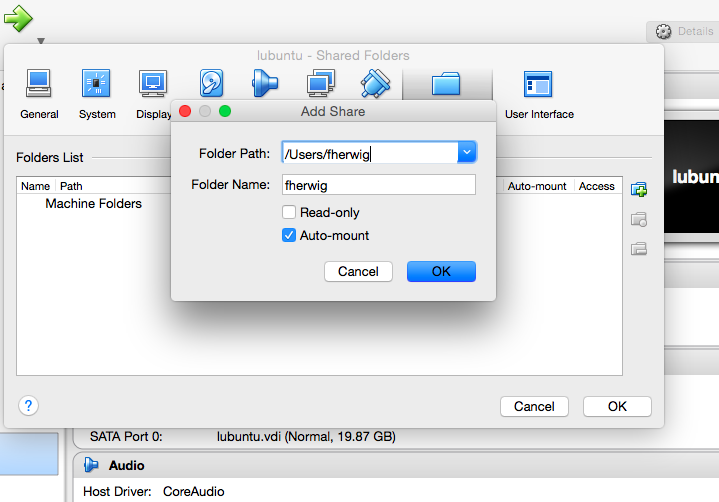

#Virtual and Real Machines for NuGrid Codes

In order to run all of the NuGrid codes and tools your computer must
be properly configured. One way to get started is to use a virtual
machine that can be deployed independently of host operating
system. This is a great way to try out installation, compilation and
running. In the following we describe two options:

1. follow the steps to install the required software while building
your own virtual machine from scratch
2. use the pre-configured
virtual machine Nubuntu16


## Build your own VM

### Lubunutu 16.04 VirtualBox VM

Start with [Lubuntu 16.04](http://cdimage.ubuntu.com/lubuntu/releases/16.04/release/) and install this into an [Oracle VirtualBox](https://www.virtualbox.org/) virtual machine. Then install the following software stack.

#### apt-get packages

Make sure you select the upgrade/update option during installation and/or start with
```
sudo apt-get update
sudo apt-get upgrade
sudo apt-get autoclean
sudo apt-get autoremove
```
Then start adding things:
```
sudo apt-get install make gcc dkms 
sudo apt-get install emacs gfortran
```
#### virtual box additions
To make the VM work nicely, e.g. adaptive screen resolution install the VBox additions.
First attach the virtual optical drive in the VM _Devices_ menue. Then do
```
sudo sh /media/fherwig/VBOXADDITIONS_5.0.26_108824/VBoxLinuxAdditions.run
```
At this point you should shut-down the VM.

#### shared dir with host and CADC
Before you restart go to _Settings_ and _Shared Folders_ and add a directory from your host home dir, or even the entire home dir as a shared folder. Select Auto-mount and remember the folder name.


Now boot the machine. Then mount the shared folder:

1. in your home dir create a mount point, e.g.  `mkdir fherwig_host`
2. then issue the mount command: `sudo mount -t vboxsf -o uid=1000,gid=1000 fherwig /home/fherwig/fherwig_host
`
in your local dir your host home dir (or whatever you have specified in your _Shared Folder_ settings, will now appear in the mount point directory.
You will have to do the second commen each time you reboot your VM. So you may want to add the mount command as an alias to your `.bashrc` file.

You may also want to add an alias to .bashrc to mount the NuGrid VOspace volume on CANFAR:
```
alias mnt.vos="mountvofs --readonly --cache_dir=/tmp/vosCache --cache_limit=2000 --mountpoint=/tmp/nugrid --vospace=vos:nugrid"
```
Don't forget to make the mount point needed for the mount command:
```
$ mkdir /tmp/nugrid
```
Remember that presently (as of Oct 9, 2016) CANFAR VOS does not support Python 3 (see below how switch between Python 2 and 3 using the Anaconda distribution.

#### git and repos
Install and configure git:
```
sudo apt install git
git config --global user.name "Falk Herwig"
git config --global user.email "fherwig@uvic.ca"
```
In order to access your git repos on github you need to add your `id_rsa` key to your VM. If you have mounted your host home dir (see above) you have access to your ssh key from your host, the public version of it you will probably already have uploaded to github. Make a directory `.ssh` in your VM home dir and copy the private ssh key from your host to your VM:
```
cp ~/fherwig_host/.ssh/id_rsa ~/.ssh
```

Now you may clone repos to your VM or go to your repo dir in your mounted host filesystem. Start installing some repos:
```
mkdir Repos
cd Repos
git clone git@github.com:NuGrid/NuSE.git
git clone git@github.com:NuGrid/NuGridPy.git
git clone git@github.com:NuGrid/NuPPN.git
```

#### Linear Algebra

To run the NuGrid [NiPPN](https://github.com/NuGrid/NuPPN) codes you need something like openblas, see the corresponding  [NuPPN wiki page: ](https://github.com/NuGrid/NuPPN/wiki/installation-dependencies).

As an example, installing openblas from scratch:
```
git clone https://github.com/xianyi/OpenBLAS
cd OpenBLAS/
make FC=gfortran
sudo make PREFIX=/usr/local install
```

Alternatively, for example you may use the package installer:
```
sudo apt-get install libopenblas-dev
```

#### python
You will need some [python](https://github.com/NuGrid/NuGridDoc/blob/master/Resources/Python.md).
Here we use the Anaconda distribution which has everyting except the _future_ (or _futures_) package:

1. Download Anaconda: https://www.continuum.io/downloads#linux
2. install: `bash ~/Downloads/Anaconda3-4.1.1-Linux-x86_64.sh`
3. you will likely want to create a python 2.7 virtual environment as well using _conda_: `conda create -n py27 python=2.7 anaconda`

#### Latex 
In order to use the NuGrid [Paper](https://github.com/NuGrid/Paper) template install the following packages using the `sudo apt-get install` command:

1. `texlive-latex-base`
2. `texlive-latex-recommended`
3. `texlive-publishers` 

Some of these installation steps appears to take a little longer. You can use the _evince_ program to look at pdf files.

MNRAS requires packages `newtxtext` and `newtxmath` which may require
to [install TexLive
2016](https://www.tug.org/texlive/quickinstall.html) which takes a
moment but should be straight forward.

#### Markdown
To edit [markdown](./editing.md) files you can use emacs or whatever your favourite text editor is. For a two-pannel view [download](http://remarkableapp.github.io/linux/download.html) the `.deb` package of the [Remarkable](http://remarkableapp.github.io/index.html) markdown editor. Double-click on the `.deb` file in the file manager to install.

## Nubuntu16 virtual machine
Nubuntu16 is a virtual drive created with the intent of making use of
NuGrid tools a breeze for new or casual users.

+ In order to install it go to [this link](https://www.virtualbox.org/wiki/Downloads) and follow the download instructions. 
+ Next, you will need a copy of the Nubuntu16 VM zip directory. You can get this [here](http://astrowww.phys.uvic.ca/~fherwig/NuGrid_Nubuntu/);   password protected: see [VirtualBox releases](http://www.nugridstars.org/general-info-for-members)
+ Once you download and unzip the directory you simply have to click on Nubuntu16.vbox which will automatically launch the VM. Otherwise you can launch it via the VirtualBox Manager. 
+ On the desktop you will find a file entitled "README.md" This will guide you to download a copy of the NuGrid SVN repository, and gives clear instructions on how to compile ppn.
+ More information can be found on the [NuGrid Plone](http://www.nugridstars.org/data-and-software/virtual-box-releases); that documentation includes links to older VMs (e.g. Nubuntu access) that are a bit old at this point and should be updated. 
